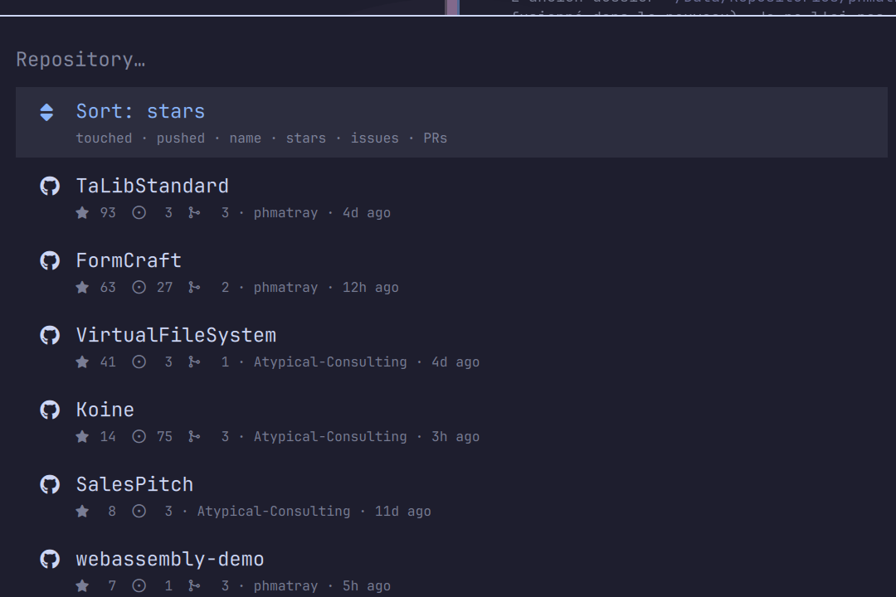
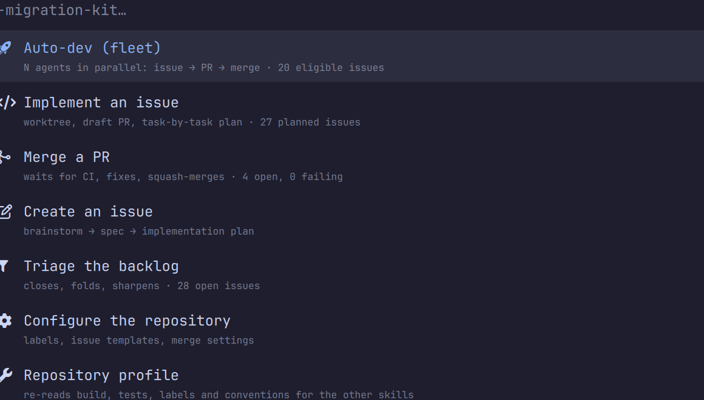
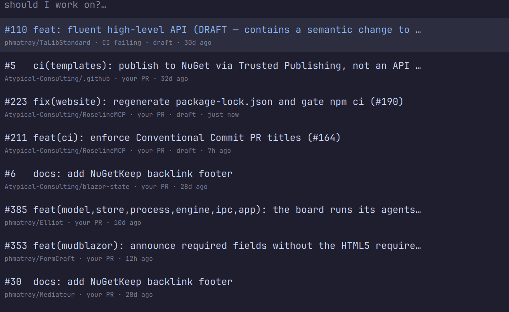

# AI Kit

[](https://github.com/macarchy/omarchy-aikit/actions/workflows/ci.yml)
[](https://omarchyplugins.com/)
[](LICENSE)

**Your backlog, one keystroke away.** Point at a repository, pick a skill, walk
away — and watch the bar tell you when a fleet of agents has landed the PRs.

Run [AI Migration Kit](https://github.com/phmatray/ai-migration-kit) skills for
Claude Code from the [Omarchy](https://omarchy.org/) desktop: pick a repository,
pick a skill, and the session starts in a tmux terminal. Menus read a local
SQLite mirror kept fresh in the background — **no menu ever waits on the network**.


`SUPER + CTRL + M`, or a click on 󱓞 in the bar: choose a repository — sortable,
with stars, open issues and open PRs — then a skill, whose subtitle carries the
repository's real state.




The parameter follows (an issue or a PR is picked from a list, never a number you
have to remember), and the session starts:
`claude "/ai-migration-kit:<skill> …"`.

## Claude alone

`aikit claude` (*Open Claude* in the skill menu, or *AI Kit · Claude* in the
Omarchy menu) skips the skills: pick a repository and Claude opens there with no
prompt, **in a fresh git worktree** (`claude --worktree`, under
`.claude/worktrees/`), so a session started on a whim never dirties the checkout.
It gets the same tmux session, bar entry and finish notification as a skill run.

`claude --worktree` refuses a repository Claude Code has not *trusted* yet, and
that trust is only recorded during an ordinary session. aikit never writes it on
Claude's behalf: the first time, it offers to open Claude in the checkout itself,
once, and every later session opens in a worktree. Bind it where Omarchy keeps
its agent key:

```lua
hl.unbind("SUPER + SHIFT + CTRL + A")            -- Omarchy: omarchy-agent --pick
o.bind("SUPER + SHIFT + CTRL + A", "Claude (worktree)", "aikit claude")
```

## Work queue

`aikit work` (middle-click on 󱓞, or *AI Kit · work queue* in the menu) answers
"what should I work on?" **without picking a repository first**: one list, every
repository, ordered by what matters — what is broken, then what blocks someone
else, then what is yours.



Picking a row opens the right session in the right clone: `merge-pr` for one of
your PRs, `/code-review` for a requested review, `implement-issue` for an issue.
With no local clone, the GitHub page opens instead.

## Navigation

`↑` `↓` move, typing filters, `→` or `Enter` confirm. `Escape`, the *Back* row,
or `←` **go back one step** — from the issue list to the skill menu, from the
skill menu to the repository picker — instead of cancelling everything. From the
repository picker, `Escape` closes.

One session per launch: two repositories with the same folder name under
different owners (`phmatray/.github` and `macarchy/.github`) get
distinct sessions, and re-running a skill on a repository that already has one
starts a fresh session rather than silently re-attaching to the previous one.
Once Claude exits, the pane stays open so the output is readable: the session is
then marked *finished* and no longer counts as work in flight.

## Installation

**Bar widget** (Omarchy Quattro):

```bash
omarchy plugin add https://github.com/macarchy/omarchy-aikit.git --enable
```

**CLI and sync service** — from source for now. The `aikit-git` PKGBUILD is
written and builds here (`makepkg --printsrcinfo` and a full `makepkg` run both
succeed), but it has not been linted with `namcap` and nothing has been pushed to
the AUR; both remain [manual steps for the maintainer](docs/aur.md):

```bash
git clone https://github.com/macarchy/omarchy-aikit && cd omarchy-aikit
./install.sh                       # symlinks, systemd timer, Omarchy entries
aikit doctor                       # prerequisites, one by one
aikit-selftest                     # 60 checks, no network, no windows
```

`./install.sh --dry-run` shows what it would touch; `./uninstall.sh` undoes
everything (the database and cache are kept). Every replaced file is backed up
with a timestamp.

Sessions launched from here run unattended, so `claude` gets
`--dangerously-skip-permissions` by default (`AIKIT_CLAUDE_FLAGS` overrides it);
Claude Code asks you to acknowledge that mode once, the first time.

`aikit doctor` checks the prerequisites one by one and says what to install:
authenticated `gh`, `tmux`, `jq`, `python3`, `sqlite3`, `git`, `claude` (and that
it knows the flags you pass it), Omarchy,
and the [ai-migration-kit](https://github.com/phmatray/ai-migration-kit) plugin
on the Claude Code side, **version 2.0.0 or later** — without it, the skills do
not exist (2.0 renamed several of them, with no aliases).

Repository roots are guessed on first run from the usual places (`~/src`,
`~/code`, `~/dev`, `~/git`, `~/repos`, `~/Projects`, `~/Work`, `~/Development`);
`AIKIT_ROOTS` overrides them, in the environment or in `~/.config/aikit/config`.

## What the database holds, and where it stays

`~/.local/share/aikit/aikit.db` stores **repository names, issue and PR titles,
labels and CI states — including for your private repositories**. It is written
by `aikit-sync` through your authenticated `gh`, it lives under your account, and
**it never leaves the machine**: nothing ever sends it anywhere. `uninstall.sh`
leaves it in place; delete `~/.local/share/aikit` and `~/.cache/aikit` to erase
everything.

## The pieces

| Path | Role |
|---|---|
| `bin/aikit` | the flow: repository → skill → parameters → tmux session (or `aikit claude`: repository → worktree → Claude) |
| `bin/aikit-status` | one command, one truth: what the bar renders |
| `bin/aikit-sync` | fills the database from GitHub (systemd timer, 5 min) |
| `bin/aikit-selftest` | plays the flows against a stubbed sandbox |
| `share/rows.py` | builds menu rows from the database |
| `share/strings.json` | EN/FR string catalogue, single source |
| `manifest.json`, `BarWidget.qml` | the Omarchy plugin, at the repository root where `omarchy plugin add` expects them |

## The database

Three tiers, so you only pay for what you use:

* **tier 1** — one `gh repo list` per account: stars, open issues and open PRs for
  every repository, plus the local clone path. Refreshed when older than 30 min.
* **tier 2** — detailed issues and PRs (titles, labels, implementation plan, CI
  state) for *tracked* repositories only: those you have opened at least once
  through aikit, and every repository that shows up in the work queue.
* **tier 3** — the work queue: four GitHub searches (`review-requested`,
  `author:@me`, `status:failure`, `assignee:@me`) covering *all* repositories,
  plus the planned, right-sized issues of tracked repositories.

`aikit-sync --status` shows how old the data is and whether syncing is healthy.
A failure (expired token, no network) is recorded in the database and surfaces in
the bar:  followed by the error message — a mirror that stopped updating must
never lie quietly.

## The bar widget

This repository **is also an Omarchy plugin**: `manifest.json` and
`BarWidget.qml` sit at the root, where `omarchy plugin add` expects them.

```
󱓞          nothing running
󱓞 2 · 7✓   two sessions, seven PRs merged
󱓞 2 !      a detached, silent session: an agent is waiting on a decision
󱓞          syncing is failing (details on hover)
```

| Gesture | Action |
|---|---|
| left click | pick a repository, then a skill |
| middle click | the work queue, across every repository |
| right click | resume a running session |

The QML only renders: everything comes from the `aikit-status` command as
Waybar-style JSON (`{text, tooltip, class}`). Settings on the widget entry in
`shell.json`: `interval` (10 s), `exec` (`aikit-status`), `launcher` (`aikit`).

Without the plugin, `aikit setup` installs an equivalent `type: command` entry —
it never installs both.

## Conventions

**Menu contract.** Every row is `<key>\t<glyph>\t<label>\t<subtitle>`; `menu_pick`
sends only the display part to the menu and returns the key. Nothing is ever
reconstructed by splitting the text shown to the user — that is what lets a
repository be called `gamma · delta`, or an issue be titled `#999 crash`.

**Icons.** Always by code point (`$''`, `chr(0x…)`), never by pasting the
glyph: characters from the Basic Multilingual Plane get lost along the way.
Check presence with `fc-list "JetBrainsMono Nerd Font" charset`, then check the
meaning by rendering a sample.

**Language.** `strings.json` carries English and French; the language follows the
locale, `AIKIT_LANG=fr` forces it.

## Settings

| Variable | Default | Effect |
|---|---|---|
| `AIKIT_ROOTS` | guessed from the usual places | where to look for clones |
| `AIKIT_CLAUDE_FLAGS` | `--dangerously-skip-permissions` | flags passed to every `claude` session |
| `AIKIT_LANG` | locale | `en` or `fr` |
| `AIKIT_STALL_SECS` | `300` | silence after which an agent is deemed stuck |
| `AIKIT_CLAUDE_JSON` | `~/.claude.json` | where Claude Code records trusted repositories (read only) |
| `AIKIT_SYNC_STALE_SECS` | `1200` | age after which syncing is reported as late |

## License

MIT — see [LICENSE](LICENSE).
